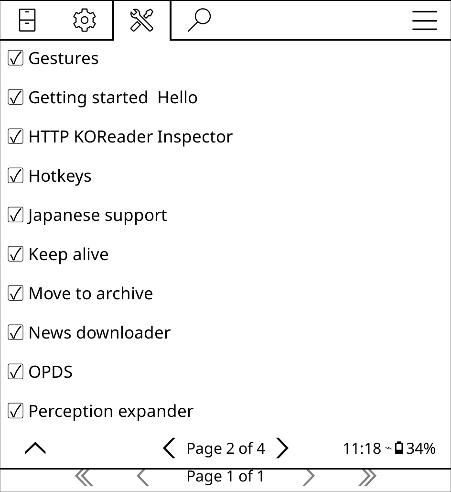

Now that you're familiar with KOReader's plugin structure, let's put that knowledge into practice by building one. The goal here isn't to create anything fancy, just the smallest possible plugin that KOReader can recognize and load.

By the end of this section you'll know how to:

- Set up a plugin directory
- Write `_meta.lua` and `main.lua`
- Understand how KOReader discovers and loads plugins
- Test your plugin locally

---

## Creating the Plugin Directory

Navigate to KOReader's plugin directory:

```text
squashfs-root/usr/lib/koreader/plugins/
```

Create a new folder for your plugin:

```bash
mkdir hello.koplugin
```

As covered in the [Installation](/docs/getting-started/installation) section, your source code can live anywhere. You can symlink or copy it into the plugins directory whenever you want to test. Many developers keep the source separate and symlink it in, so changes take effect the next time KOReader starts.

Your directory structure should now look like:

```text
plugins/
└── hello.koplugin/
```

The plugin can't be loaded yet since it contains no files.

---

## Creating `_meta.lua`

Inside the plugin directory, create a file named `_meta.lua` with the following contents:

```lua
return {
    name = "hello",
    fullname = "Hello World",
    description = "My first KOReader plugin."
}
```

```text
hello.koplugin/
└── _meta.lua
```

### What does `_meta.lua` do?

This file describes your plugin to KOReader. When scanning the plugins directory at startup, KOReader reads `_meta.lua` to identify what it's found.

| Field         | Purpose             |
| ------------- | ------------------- |
| `name`        | Internal identifier |
| `fullname`    | Name shown to users |
| `description` | Short description   |

Most plugins include additional fields, but these three are enough to get started.

---

## Creating `main.lua`

Create a second file named `main.lua`:

```lua
local WidgetContainer = require("ui/widget/container/widgetcontainer")

local Hello = WidgetContainer:extend{
    name = "hello",
}

return Hello
```

Your plugin now has both required files:

```text
hello.koplugin/
├── _meta.lua
└── main.lua
```

### What does `main.lua` do?

This is your plugin's entry point. KOReader executes this file when loading the plugin and expects it to return a plugin object. The pattern is straightforward:

1. Import any required modules
2. Define a plugin class that extends an existing KOReader class
3. Return the plugin object

---

## How KOReader Loads Plugins

On startup, KOReader scans the plugins directory for any folder ending in `.koplugin` and attempts to load each one:

```text
KOReader Startup
        │
        ▼
Scan plugins directory
        │
        ▼
Read _meta.lua
        │
        ▼
Load main.lua
        │
        ▼
Create plugin object
        │
        ▼
Register plugin
```

If both files are valid, the plugin is registered and available within KOReader.

---

## Launching and Testing

From the root of the extracted AppImage, start KOReader:

```bash
cd squashfs-root
./AppRun
```

If your plugin loaded successfully, KOReader will start normally with no errors. Since no menu items have been added yet, the plugin won't be visible anywhere obvious, but you can confirm it loaded by navigating to Tools > More Tools > Plugin Management in the top navigation bar. Loaded plugins are listed alphabetically.



Running KOReader from a terminal like this is useful during development. Syntax errors, missing modules, and malformed plugin definitions will appear in the terminal output as they occur.

---

## Next Steps

You now have a working (if minimal) KOReader plugin:

```text
hello.koplugin/
├── _meta.lua
└── main.lua
```

In the next section, we'll explore the plugin lifecycle and learn how plugins interact with the rest of the application once they've been loaded.
